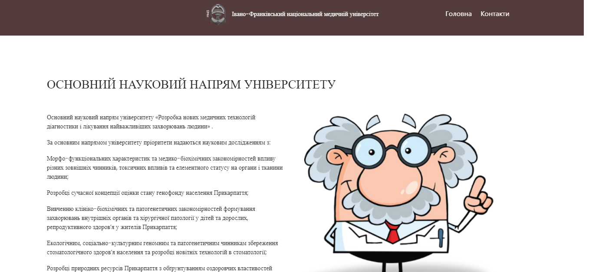
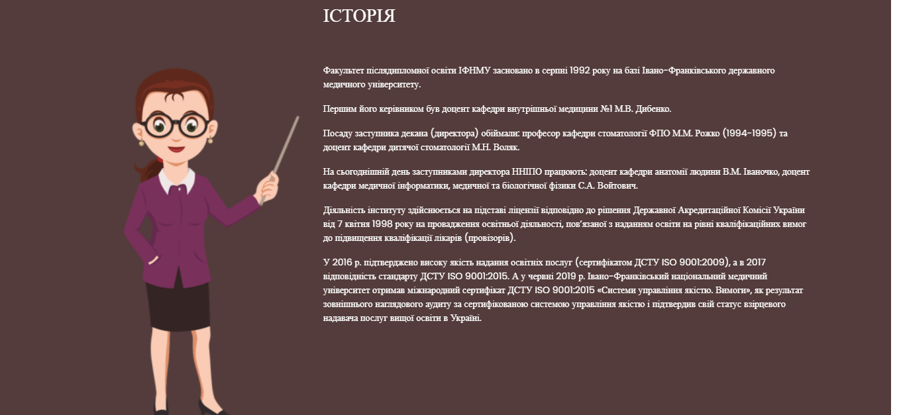
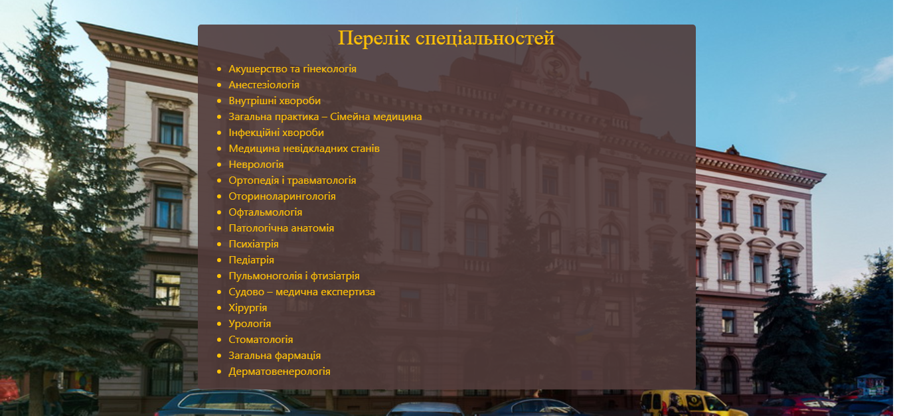
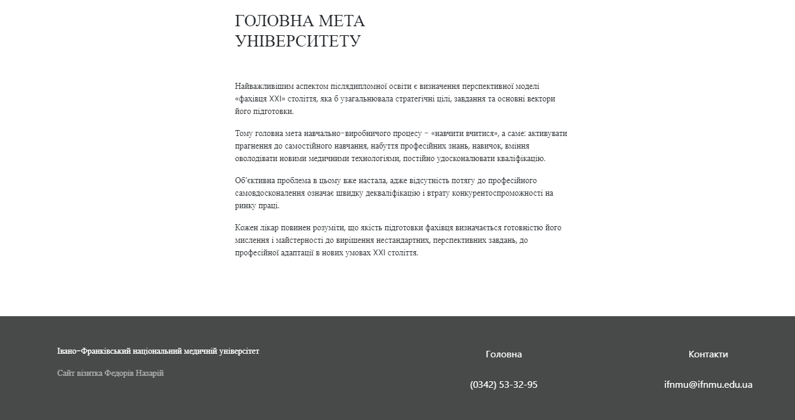
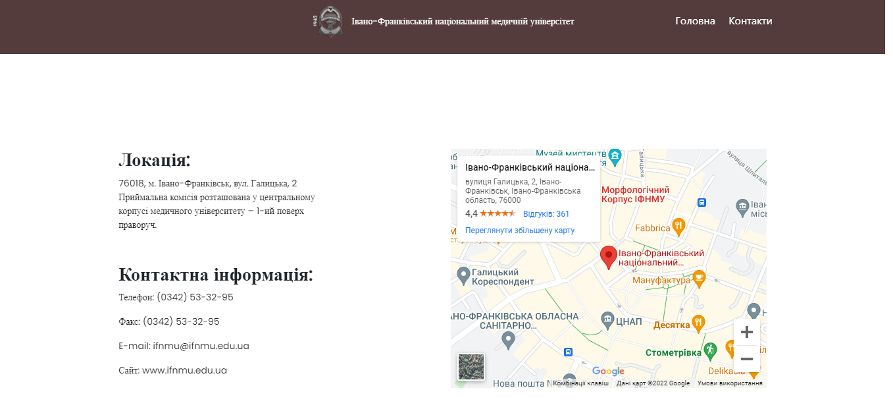

<p align="center"></p>
<h1 align="center">"Івано-Франківський національний медичній універсітет"</h1>

## Description
<b>EN:</b>

This is my individual task in internship.

The project visualizes the work of the business card website of the **Ivano-Frankivsk National Medical University** (not an official website).

<b>UA:</b>

Це моє індивідуальне завдання на навчальній практиці.

Проект візуалізує роботу сайту візитки **Івано-Франківського національного медичного університету** (не офіційний сайт).

#
## Screenshots
<p>
  
  
  
  
  
</p>

#
## Technologies used
<b>EN:</b>
- Using **Bootstrap** (front-end framework)
- Using **Google Maps**
- Navigation on the site
- Made from a template I ordered from [Figma](https://www.figma.com)

<b>UA:</b>
- Використання **Bootstrap** (front-end framework)
- Використання **Google Maps**
- Навігація по сайту
- Створено відповідно до шаблону, який я замовив у [Figma](https://www.figma.com)

#
## License
```
© 2022, CoolOtaku (ericspz531@gmail.com)
```
